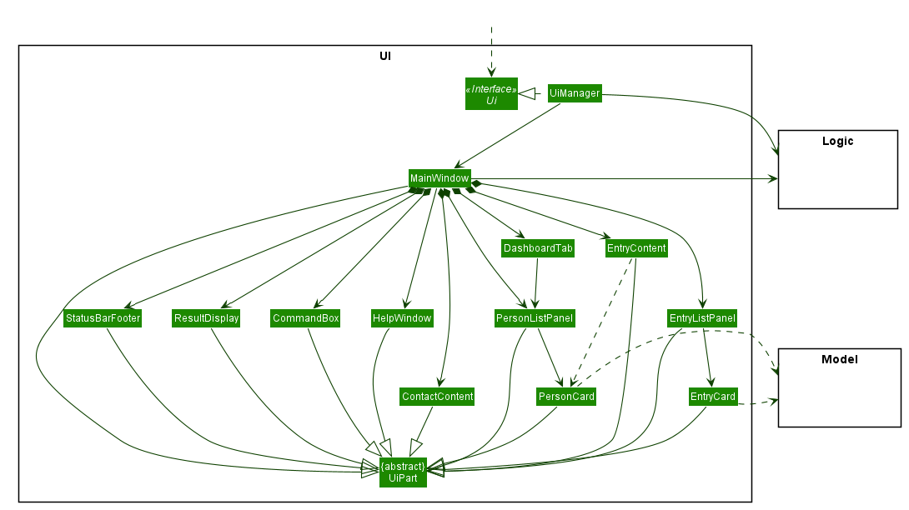
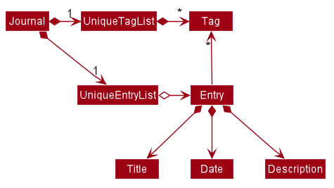
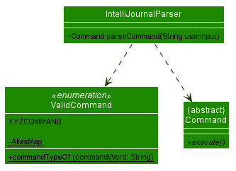
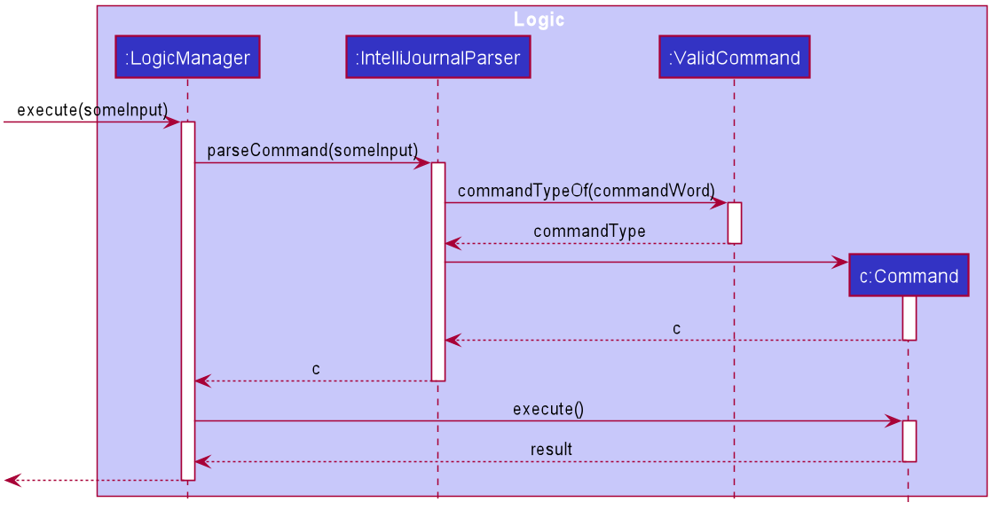
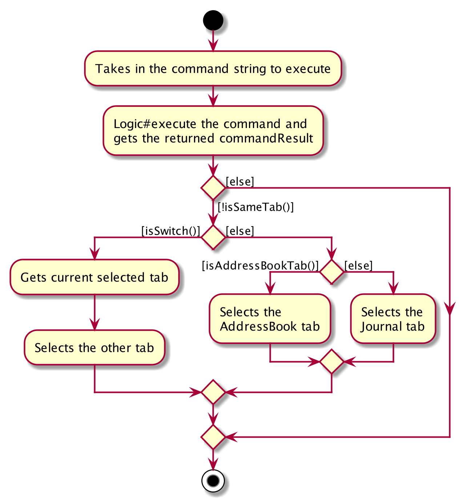
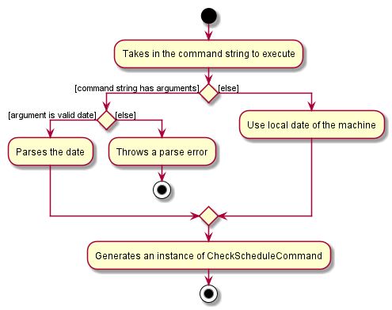
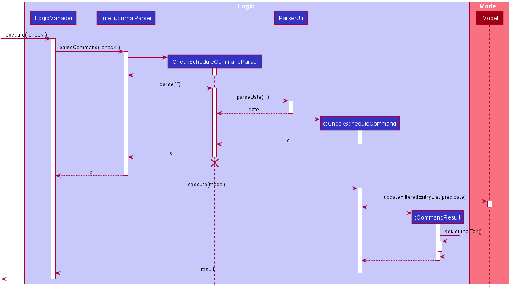
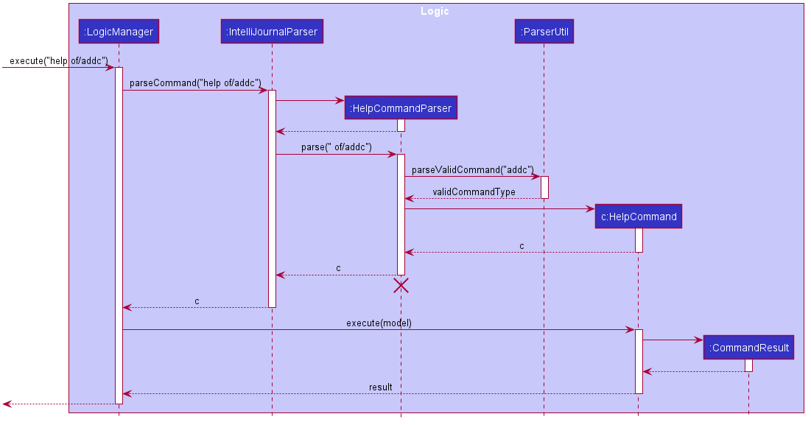

* Table of Contents
{:toc}

--------------------------------------------------------------------------------

## **Setting up, getting started**

Refer to the guide [_Setting up and getting started_](SettingUp.md).

--------------------------------------------------------------------------------

## **Design**

### Architecture


The ***Architecture Diagram*** given above explains the high-level design of the
App. Given below is a quick overview of each component.

**`Main`** has two classes called [`Main`](https://github.com/AY2021S1-CS2103T-W17-4/tp/blob/master/src/main/java/seedu/address/Main.java)
and [`MainApp`](https://github.com/AY2021S1-CS2103T-W17-4/tp/blob/master/src/main/java/seedu/address/MainApp.java).
It is responsible for,
* At app launch: Initializes the components in the correct sequence, and connects them up with each other.
* At shut down: Shuts down the components and invokes cleanup methods where necessary.

[**`Commons`**](#common-classes) represents a collection of classes used by multiple other components.

The rest of the App consists of four components.

* [**`UI`**](#ui-component): The UI of the App.
* [**`Logic`**](#logic-component): The command executor.
* [**`Model`**](#model-component): Holds the data of the App in memory.
* [**`Storage`**](#storage-component): Reads data from, and writes data to, the hard disk.

Each of the four components,

* defines its *API* in an `interface` with the same name as the Component.
* exposes its functionality using a concrete `{Component Name}Manager` class (which implements the corresponding API `interface` mentioned in the previous point.

For example, the `Logic` component (see the class diagram given below) defines its API in the `Logic.java` interface and exposes its functionality using the `LogicManager.java` class which implements the `Logic` interface.


**How the architecture components interact with each other**

The *Sequence Diagram* below shows how the components interact with each other for the scenario where the user issues the command `delete 1`.


The sections below give more details of each component.

### UI component



**API** :
[`Ui.java`](https://github.com/AY2021S1-CS2103T-W17-4/tp/blob/master/src/main/java/seedu/address/ui/Ui.java)

The UI consists of a `MainWindow` that is made up of parts e.g.`CommandBox`, `ResultDisplay`, `PersonListPanel`, `StatusBarFooter` etc. All these, including the `MainWindow`, inherit from the abstract `UiPart` class.

The `UI` component uses JavaFx UI framework. The layout of these UI parts are defined in matching `.fxml` files that are in the `src/main/resources/view` folder. For example, the layout of the [`MainWindow`](https://github.com/AY2021S1-CS2103T-W17-4/tp/blob/master/src/main/java/seedu/address/ui/MainWindow.java) is specified in [`MainWindow.fxml`](https://github.com/AY2021S1-CS2103T-W17-4/tp/blob/master/src/main/resources/view/MainWindow.fxml)

The `UI` component,

* Executes user commands using the `Logic` component.
* Listens for changes to `Model` data so that the UI can be updated with the modified data.

### Logic component


**API** :
[`Logic.java`](https://github.com/AY2021S1-CS2103T-W17-4/tp/blob/master/src/main/java/seedu/address/logic/Logic.java)

1. `Logic` uses the `CommandParser` class to parse the user command.
1. This results in a `Command` object which is executed by the `LogicManager`.
1. The command execution can affect the `Model` (e.g. adding a person).
1. The result of the command execution is encapsulated as a `CommandResult` object which is passed back to the `Ui`.
1. In addition, the `CommandResult` object can also instruct the `Ui` to perform certain actions, such as displaying help to the user.

Given below is the Sequence Diagram for interactions within the `Logic` component for the `execute("delete 1")` API call.


<div markdown="span" class="alert alert-info">:information_source: **Note:** The lifeline for `DeleteCommandParser` should end at the destroy marker (X) but due to a limitation of PlantUML, the lifeline reaches the end of diagram.
</div>

### Model component


**API** : [`Model.java`](https://github.com/AY2021S1-CS2103T-W17-4/tp/blob/master/src/main/java/seedu/address/model/Model.java)

The `Model`,

* stores a `UserPref` object that represents the user’s preferences.
* stores the address book data.
* stores the journal data.
* exposes an unmodifiable `ObservableList<Person>` and `ObservableList<Entry>` that can be 'observed', e.g. the UI
 can be bound to this list so that the UI automatically updates when the data in the list change.
* does not depend on any of the other four components.


<div markdown="span" class="alert alert-info">:information_source: **Note:** An alternative (arguably, a more OOP) model is given below. It has a `Tag` list in the `AddressBook`, which `Person` references. This allows `AddressBook` to only require one `Tag` object per unique `Tag`, instead of each `Person` needing their own `Tag` object.<br>


Similarly, an alternative model for the Journal is given below. Like the model above, it has a `Tag` list in the
 `Journal`, which `Entry` references, allowing `Journal` to only require one `Tag` object per unique `Tag`, instead
  of each `Entry` needing their own `Tag` object.


</div>


### Storage component


**API** : [`Storage.java`](https://github.com/AY2021S1-CS2103T-W17-4/tp/blob/master/src/main/java/seedu/address/storage/Storage.java)

The `Storage` component,
* can save `UserPref` objects in json format and read it back.
* can save the address book data in json format and read it back.
* can save the journal data in json format and read it back.

### Common classes

Classes used by multiple components are in the `seedu.addressbook.commons` package.

--------------------------------------------------------------------------------------------------------------------

## **Implementation**

This section describes some noteworthy details on how certain features are implemented.

### Command alias feature
#### Current Implementation

The current implementation is to keep an enumeration `ValidCommand` which keeps
a class level `HashMap` called `aliasMap`. The `HashMap` maps a `String` to a
`ValidCommand`.

The `key` of the `HashMap` represents a valid alias of its value which is a `ValidCommand`.

The enum is declared as below:

```java
public enum ValidCommand {

    SOME_COMMAND("alias1", "alias2");

    private static final Logger logger = LogsCenter.getLogger(ValidCommand.class);

    /**
     * Map that match alias with valid command
     */
    private static final Map<String, ValidCommand> aliasMap = new HashMap<>();

    /**
     * Valid alias for the commands
     */
    private final String[] aliases;
}
```

1. `aliases` array stores valid alias for each of the `ValidCommand`
2. `aliasMap` maps alias to a `ValidCommand`

Note: *alias1, alias2, alias3* are system's default aliases. Aliases can be extended by calling `ValidCommand#addAlias(ValidCommand command, String alias)`.

Given below is the implementation of constructing the `aliasMap`:

```java_holder_method_tree

/**
   * Creates command alias from aliases list.
   *
   * @param aliases Aliases list.
*/
ValidCommand(String... aliases) {
    this.aliases = aliases;
}
```

Step 1: Construct each `ValidCommand` with a list of `String`

```java_holder_method_tree
static {
        Arrays.stream(ValidCommand.values()).forEach(command -> Arrays.stream(command.aliases)
                .forEach(alias -> {
                    assert aliasMap.get(alias) == null;
                    aliasMap.put(alias, command);
                }));
    }
```


Step 2: Use a class level initializer to construct the `aliasMap`

Given below is the class diagram of related part of command alias feature:




Note:

*`XYZCOMMAND` represents the enumeration element for valid commands that can be used in the system*
*`ValidCommand#commandTypeOf(String commandWord)` takes in a command keyword (eg. addj, addc, findc...) and returns a `ValidCommand` which will be used by `IntelliJournalParser`*

*`IntelliJournalParser#parseCommand(String UserInput)` detect the command word and pass in to the `ValidCommand#commandTypeOf(String commandWord)` to find the valid command and produce the `Command` accordingly*

Given below is the sequence diagram of command alias feature (This change only related to `Logic` component, so we omit the execution detail in model):



### Tab navigation feature

IntelliJournal has two tabs for different information to display, one tab for `Addressbook`
and another for `Journal`. The implementation of the tab UI is not the focus in this
section, under this section, it is described how commands navigates from tab to tab.

#### Current Implementation

The current implementation is to keep track of `boolean` variables under `CommandResult`
class. In `MainWindow`, when `Logic` executes a command, the returned `CommandResult` will specify the
tab navigation behaviours of the executed command, and therefore `MainWindow` can
make `Ui` changes to IntelliJournal and complete the tab navigation.

`CommandResult` implements the following methods to specify tab navigation behaviors.
* `public boolean isAddressBookTab()` - Returns `true` if the command needs to
display the `AddressBook` tab, returns `false` is the command needs to display
the `Journal` tab.
*  `public boolean isSwitch()` - Returns `true` if the command requires to switch
the current displaying tab to the other.
* `public boolean isSameTab()` - Reuturns `true` if the command requires to remain
the current displaying tab.

In `Command` classes, the `execute(Model model)` method returns a `CommandResult`
object. We assume the object to return is `commandResult` which does not have any
specifications on tab navigation behavior. In order to specify the tab navigation
behavior, one can call methods of `CommandResult` and return the following objects
instead.
* `commandResult.setAddressBookTab()` - Specifies the returned `CommandResult` to
navigate to `AddressBook` tab (i.e. `isAddressBookTab()` of the returned object
returns `true`).
* `commandResult.setJournalTab()` - Specifies the returned `CommandResult` to
navigate to `Journal` tab (i.e. `isAddressBookTab()` of the returned object returns
`false`).
* `commandResult.setSwitch()` - Specifies the returned `CommandResult` to switch the
current displaying tab to the other tab (i.e. `isSwitch()` returns `false`).
* `commandResult.setSameTab()` - Specifies the returned `CommandResult` to say on
the same displaying tab as before the execution of the current command (i.e.
`isSameTab()` returns `true`).

In `MainWindow#executeCommand`, the method will examine the returned `CommandResult`
object after `Logic` executes the command. The activity diagram below shows how
`MainWindow#executeCommand` handles tab navigation.



### Check schedule feature

IntelliJournal allows for users to check all journal entries for a given day,
allowing them to check their schedule for the given day.

#### Current Implementation

The current implementation makes use of the `CheckScheduleCommandParser` as well
as the `CheckScheduleCommand` classes. When `IntelliJournalParser` parses the
command and finds the `check` command, the rest of the command is passed into
the `CheckScheduleCommandParser`, where the rest of the command is parsed.

If the rest of the command is empty, the command is parsed as though we are
using the local date of the machine. Otherwise, if the rest of the command is
not a valid date, we throw an error.

The activity diagram for the parsing of command is given below.



The following sequence diagrams show how the check schedule command works:



In `MainWindow#executeCommand`, the returned `CommandResult` will then set the
tab back to the journal tab if the user is viewing the AddressBook tab.

### Help feature
The `help` command of IntelliJournal allows users to check the usage of a specific
command, or get the link to the User Guide for the usage of all commands.
#### Current Implementation
In the current version of IntelliJournal, the help feature is implemented with
 both `HelpCommand` and `HelpCommandParser`. If the user input starts with `help`,
 the `IntelliJournalParser` will catch it and pass the rest input into `HelpCommandParser`.

Within the `HelpCommandParser`, there are mainly 3 execution path:
1. If the argument starts with `of/` prefix, it will parse the argument behind `of/` to a
`ValidCommand`, and return a HelpCommand with the `ValidCommand`.
2. If the argument is empty, it will return a `HelpCommand` with the boolean term
`isShowHelpWindow` set to be `true`.
3. Else, it will throw an `ParseException`.

Back to `HelpCommand`, it will choose return a `CommandResult` which can make `MainWindow`
to show the help window if the `isShowHelpWindow` is `true`. Or it will return a
`CommandResult` which could print the usage of a certain valid command into result box.

The following sequence diagrams show how the help command works:



### Edit journal feature
#### Current Implementation

The current implementation of editing journal entries follows closely to the same process of editing contacts. Fields supplied as arguments are used to create an `EditJournalEntryDescriptor`, which are used to create a new `Entry` object by taking attributes from the `EditJournalEntryDescriptor` and using the original attributes from the `Entry` being edited in place of any null attributes in the `EditJournalEntryDescriptor`.

```
Title updatedTitle = editJournalEntryDescriptor.getTitle().orElse(entryToEdit.getTitle());
```
In this snippet from `createEditedEntry`, `getTitle()` returns an `Optional<Title>` which is used to determine if the new `Entry` should use the previous' attribute or not. For `Title`, `Date`, and `Description`, this same approach is used.

For the tags and contact list, defensive copies of the tags and contact list are made when creating the `EditJournalDescriptor` object. Similarly to how the list of tags are replaced by the arguments passed when editing `Person` in `EditContactCommand`, the `UniquePersonList` used to store contacts in an `Entry` will also be replaced with the contact list provided when calling `EditJournalEntryCommand`. 

The respective setters' implementations are shown below.
```
public void setContactList(UniquePersonList contactList) {
    this.contactList = new UniquePersonList();
    contactList.forEach(this.contactList::add);
}

public void setTags(Set<Tag> tags) {
    this.tags = (tags != null) ? new HashSet<>(tags) : null;
}
```
Note that a new `UniquePersonList` is created whenever `setContactList` is called, rather than to simply check if `contactList` is null like in `setTags`.

### \[Proposed\] Undo/redo feature

#### Proposed Implementation

The proposed undo/redo mechanism is facilitated by `VersionedAddressBook`. It extends `AddressBook` with an undo/redo history, stored internally as an `addressBookStateList` and `currentStatePointer`. Additionally, it implements the following operations:

* `VersionedAddressBook#commit()` — Saves the current address book state in its history.
* `VersionedAddressBook#undo()` — Restores the previous address book state from its history.
* `VersionedAddressBook#redo()` — Restores a previously undone address book state from its history.

These operations are exposed in the `Model` interface as `Model#commitAddressBook()`, `Model#undoAddressBook()` and `Model#redoAddressBook()` respectively.

Given below is an example usage scenario and how the undo/redo mechanism behaves at each step.

Step 1. The user launches the application for the first time. The `VersionedAddressBook` will be initialized with the initial address book state, and the `currentStatePointer` pointing to that single address book state.


Step 2. The user executes `delete 5` command to delete the 5th person in the address book. The `delete` command calls `Model#commitAddressBook()`, causing the modified state of the address book after the `delete 5` command executes to be saved in the `addressBookStateList`, and the `currentStatePointer` is shifted to the newly inserted address book state.


Step 3. The user executes `add n/David …​` to add a new person. The `add` command also calls `Model#commitAddressBook()`, causing another modified address book state to be saved into the `addressBookStateList`.


<div markdown="span" class="alert alert-info">:information_source: **Note:** If a command fails its execution, it will not call `Model#commitAddressBook()`, so the address book state will not be saved into the `addressBookStateList`.

</div>

Step 4. The user now decides that adding the person was a mistake, and decides to undo that action by executing the `undo` command. The `undo` command will call `Model#undoAddressBook()`, which will shift the `currentStatePointer` once to the left, pointing it to the previous address book state, and restores the address book to that state.


<div markdown="span" class="alert alert-info">:information_source: **Note:** If the `currentStatePointer` is at index 0, pointing to the initial AddressBook state, then there are no previous AddressBook states to restore. The `undo` command uses `Model#canUndoAddressBook()` to check if this is the case. If so, it will return an error to the user rather
than attempting to perform the undo.

</div>

The following sequence diagram shows how the undo operation works:


<div markdown="span" class="alert alert-info">:information_source: **Note:** The lifeline for `UndoCommand` should end at the destroy marker (X) but due to a limitation of PlantUML, the lifeline reaches the end of diagram.

</div>

The `redo` command does the opposite — it calls `Model#redoAddressBook()`, which shifts the `currentStatePointer` once to the right, pointing to the previously undone state, and restores the address book to that state.

<div markdown="span" class="alert alert-info">:information_source: **Note:** If the `currentStatePointer` is at index `addressBookStateList.size() - 1`, pointing to the latest address book state, then there are no undone AddressBook states to restore. The `redo` command uses `Model#canRedoAddressBook()` to check if this is the case. If so, it will return an error to the user rather than attempting to perform the redo.

</div>

Step 5. The user then decides to execute the command `list`. Commands that do not modify the address book, such as `list`, will usually not call `Model#commitAddressBook()`, `Model#undoAddressBook()` or `Model#redoAddressBook()`. Thus, the `addressBookStateList` remains unchanged.


Step 6. The user executes `clear`, which calls `Model#commitAddressBook()`. Since the `currentStatePointer` is not pointing at the end of the `addressBookStateList`, all address book states after the `currentStatePointer` will be purged. Reason: It no longer makes sense to redo the `add n/David …​` command. This is the behavior that most modern desktop applications follow.


The following activity diagram summarizes what happens when a user executes a new command:


#### Design consideration:

##### Aspect: How undo & redo executes

* **Alternative 1 (current choice):** Saves the entire address book.
  * Pros: Easy to implement.
  * Cons: May have performance issues in terms of memory usage.

* **Alternative 2:** Individual command knows how to undo/redo by
  itself.
  * Pros: Will use less memory (e.g. for `delete`, just save the person being deleted).
  * Cons: We must ensure that the implementation of each individual command are correct.

_{more aspects and alternatives to be added}_

### \[Proposed\] Data archiving

_{Explain here how the data archiving feature will be implemented}_


--------------------------------------------------------------------------------------------------------------------

## **Documentation, logging, testing, configuration, dev-ops**

* [Documentation guide](Documentation.md)
* [Testing guide](Testing.md)
* [Logging guide](Logging.md)
* [Configuration guide](Configuration.md)
* [DevOps guide](DevOps.md)

--------------------------------------------------------------------------------------------------------------------

## **Appendix: Requirements**

### Product scope

**Target user profile**:

* has a need to manage a significant number of contacts
* has a need to keep track of his meetings with contacts
* prefer desktop apps over other types
* can type fast
* prefers typing to mouse interactions
* is reasonably comfortable using CLI apps

**Value proposition**: manage contacts faster than a typical mouse/GUI driven app


### User stories

Priorities: High (must have) - `* * *`, Medium (nice to have) - `* *`, Low (unlikely to have) - `*`

| Priority | As a…​ | I want to…​                       | So that I can…​                                                   |
| :---:    | :---        | :---                                   | :---                                                                   |
| `* * *`  | new user    | see usage instructions                 | refer to instructions when I forget how to use the App                 |
| `* * *`  | user        | add a new person                       |                                                                        |
| `* * *`  | user        | delete a person                        | remove entries that I no longer need                                   |
| `* * *`  | user        | find a person by name                  | locate details of persons without having to go through the entire list |
| `* * *`  | user        | add a journal entry                    | record an events                                                       |
| `* * *`  | user        | delete a journal                       | remove an event that is not important from journal                     |
| `* * *`  | user        | list all journal entries               |                                                                        |
| `* * *`  | user        | list all contacts in the contacts list |                                                                        |
| `* * *`  | user        | search journal entries                 | navigate to the entry that I am interested                             |

*{More to be added}*

### Use cases

(For all use cases below, the **System** is the `intelliJournal` and the **Actor** is the `user`, unless specified otherwise)

**Use case: Delete a person**

**MSS**

1.  User requests to list persons
2.  IntelliJournal shows a list of persons
3.  User requests to delete a specific person in the list
4.  AddressBook deletes the person

    Use case ends.

**Extensions**

* 2a. The list is empty.

  Use case ends.

* 3a. The given index is invalid.

    * 3a1. IntelliJournal shows an error message.

      Use case resumes at step 2.


**Use case: Delete a journal entry**

**MSS**

1. User request to list persons
2. IntelliJournal shows a list of journal entry
3. User request to delte a specific journal entry in the list
4. IntelliJournal deletes the entry

    Use case ends

**Extensions**
* 2a. The journal is empty (No entry in journal)

    Use case ends
* 3a.  The given index is invalid
    * 3a1. IntelliJournal shows an error message.

        Use case resumes at step 2.

**Use case: Search for a journal entry (by entry name)**

**MSS**

1. User request to list entries
2. User search the entry/entries with given name
3. Intellij journal display a list of filtered entries

**Extension**
* 2a. The journal is empty (No entry in journal)

    Use case ends
* 3a.  The given name is not in journal
    * 3a1. IntelliJournal shows an error message.

        Use case resumes at step 1.

*{More to be added}*

### Non-Functional Requirements

1.  Should work on any _mainstream OS_ as long as it has Java `11` or above installed.
2.  Should be able to hold up to 1000 persons and journals without a noticeable sluggishness in performance for typical usage.
3.  A user with above average typing speed for regular English text (i.e. not code, not system admin commands) should be able to accomplish most of the tasks faster using commands than using the mouse.

*{More to be added}*

### Glossary

* **Mainstream OS**: Windows, Linux, Unix, MacOS

--------------------------------------------------------------------------------------------------------------------

## **Appendix: Instructions for manual testing**

Given below are instructions to test the app manually.

<div markdown="span" class="alert alert-info">:information_source: **Note:** These instructions only provide a starting point for testers to work on;
testers are expected to do more *exploratory* testing.

</div>

### Launch and shutdown

1. Initial launch

   1. Download the jar file and copy into an empty folder

   1. Double-click the jar file Expected: Shows the GUI with a set of sample contacts. The window size may not be optimum.

1. Saving window preferences

   1. Resize the window to an optimum size. Move the window to a different location. Close the window.

   1. Re-launch the app by double-clicking the jar file.<br>
       Expected: The most recent window size and location is retained.

1. _{ more test cases …​ }_

### Deleting a person

1. Deleting a person while all persons are being shown

   1. Prerequisites: List all persons using the `listc` command. Multiple persons in the list.

   1. Test case: `deletec 1`<br>
      Expected: First contact is deleted from the list. Details of the deleted contact shown in the status message. Timestamp in the status bar is updated.

   1. Test case: `deletec 0`<br>
      Expected: No person is deleted. Error details shown in the status message. Status bar remains the same.

   1. Other incorrect delete commands to try: `deletec`, `deletec x`, `...` (where x is larger than the list size)<br>
      Expected: Similar to previous.

1. _{ more test cases …​ }_

### Saving data

1. Dealing with missing/corrupted data files

   1. _{explain how to simulate a missing/corrupted file, and the expected behavior}_

1. _{ more test cases …​ }_
